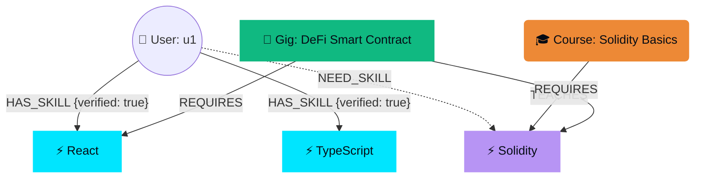

# 🌌 SkillGraph — Decentralized Talent Network & Skill Graph Engine

**SkillGraph** is a next-generation decentralized talent marketplace that leverages graph database intelligence to map, verify, and match developer skills with real-time project bounties. 

Built for modern hackathons, SkillGraph solves the core issues of trust, centralized fees, and unstructured learning paths in today's gig economy.

---

## 💡 The Core Problem

1. **Unverified Resumes:** Traditional talent networks rely on self-reported developer resumes, leading to trust issues and expensive, repetitive technical screening.
2. **Disconnected Learning:** Developers know they need skills to qualify for jobs, but there is no direct, automated link recommending *exactly* what micro-course will unlock a specific gig.
3. **High Intermediary Fees:** Centralized platforms take up to 20% of developer earnings and delay payouts.

## 🚀 The SkillGraph Solution

SkillGraph structures the entire talent ecosystem as a **directed knowledge graph** in **Neo4j**, connecting four key entities:
* 🧑 **Users:** Talent nodes with verified skill relationships.
* ⚡ **Skills:** Technologies, libraries, or frameworks (e.g., Solidity, React, Neo4j).
* 💼 **Gigs / Bounties:** Project contracts with budget rewards and skill requirements.
* 🎓 **Courses:** Interactive micro-learning models that teach and verify skills.

By mapping these entities, SkillGraph computes the exact **"Skill Gap"** using a Graph Recommendation Engine, pointing developers to the exact courses (bridge nodes) they need to complete to unlock live bounties.

---

## 🛠️ System Architecture



---

## 🌟 Key Technical Features

### 1. Neo4j Graph Recommendation Engine
The heart of SkillGraph is its advanced **Cypher query engine**. When a user views a gig, the engine dynamically calculates the overlap between the user's verified skills and the gig's required nodes:
* It identifies the missing skills.
* It matches and recommends courses teaching those specific missing skills.
* It calculates a real-time **Match Percentage** based on the requirements.

### 2. Seamless Micro-Learning & Verification
* **In-App Course Player:** Developers take short, interactive courses consisting of concept text, code challenges, and quizzes.
* **Graph Mutations:** Completing a course automatically writes a new `HAS_SKILL {verified: true}` relationship between the `User` and `Skill` node in Neo4j, instantly updating their profile graph.

### 3. Web3 Wallet & Payment Layer
* **Instant Withdrawals:** Completed bounties accumulate USD cents in the app.
* **On-Chain Payouts:** Integrates a Web3 wallet connection simulation that pays developers out directly via blockchain (e.g., simulated Base Sepolia transactions) with cryptographic TxHashes.

### 4. Rich, Futuristic Cyberpunk UI/UX
* Built with **React Native / Expo** using a dark-theme system.
* Sleek bento-box dashboard layouts using **Expo Blur** overlays.
* Smooth, spring-loaded animations (`Animated.spring`) for visual feedback.
* **Command Palette:** A terminal-like input (`>_`) that lets users run quick global commands or search terms.

---

## 🔌 Technology Stack

* **Frontend Framework:** React Native / Expo (TypeScript)
* **Graph Database:** Neo4j AuraDB (Fully cloud-managed graph database)
* **REST Services:** Base44 REST Client (Mocked fallback modes for resilient hackathon demos)
* **Styling & Theme:** Premium Dark Mode CSS (featuring glassmorphism and HSL-based glow borders)

---

## 🚀 Deployment Guide

Depending on your hackathon presentation format, you can deploy SkillGraph in three ways:

### 1. Web Deployment (Recommended for fast demo sharing)
SkillGraph is fully compatible with Expo Web, allowing you to deploy it as a static website to Vercel, Netlify, or GitHub Pages.

1. **Export the Web Build:**
   ```bash
   npx expo export --platform web
   ```
   This will generate a static production bundle in the `dist` directory.
2. **Deploy to Vercel/Netlify:**
   - Install the Vercel CLI (`npm install -g vercel`) and run `vercel` in the project root, or push to GitHub and import the repository into the Vercel/Netlify dashboard.
   - **Configure Environment Variables:** Add your `.env` values (`EXPO_PUBLIC_NEO4J_URI`, etc.) in the project settings on Vercel/Netlify.
   - **Build Settings:** 
     - **Build Command:** `npx expo export --platform web`
     - **Output Directory:** `dist`

### 2. Expo Go Deployment (Ideal for live mobile testing)
You can share a running version of the app directly with judges via the Expo Go app.

1. **Sign in to Expo CLI:**
   ```bash
   npx expo login
   ```
2. **Publish the Project:**
   ```bash
   npx expo export
   ```
3. Use **Expo EAS Update** to host the build on Expo's servers and generate a shareable QR code that judges can scan with their phone cameras to launch the app instantly inside Expo Go.

### 3. Native Mobile Build (EAS Build)
To build standalone binary packages (`.apk` or `.aab` for Android, `.ipa` for iOS):

1. **Install EAS CLI & Log In:**
   ```bash
   npm install -g eas-cli
   eas login
   ```
2. **Configure project:**
   ```bash
   eas build:configure
   ```
3. **Run Build Commands:**
   - **Android:** `eas build --platform android --profile preview` (generates a download link for an APK file)
   - **iOS:** `eas build --platform ios --profile preview` (requires an Apple Developer Program subscription)

